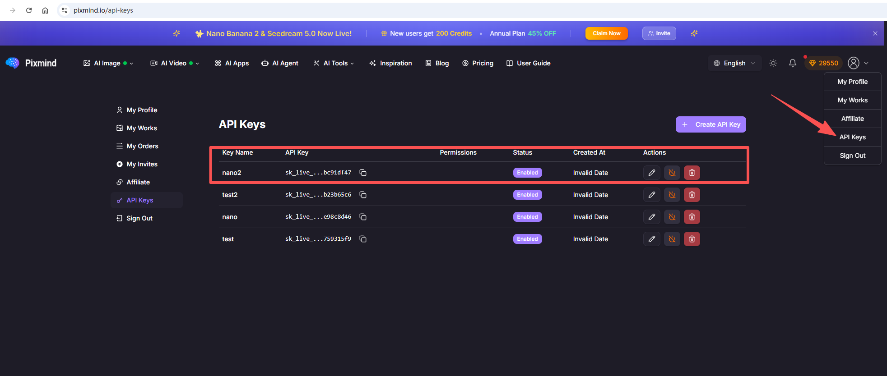

# Pixmind Claw Skills

OpenClaw skills for AI image and video generation via [Pixmind](https://www.pixmind.io/) API.

## Prerequisites

1. Register at [pixmind.io](https://www.pixmind.io/)
2. Open the [API Platform key dashboard](https://www.pixmind.io/api-platform/dashboard/keys) and click **+ Create API Key**



## Install

```bash
clawhub install pixmind-image
clawhub install pixmind-video
clawhub install pixmind-image-compress
clawhub install pixmind-video-to-prompt
```

## Configure

Set the API key in your environment (OpenClaw also injects it from the skill configuration):

```bash
export PIXMIND_API_KEY=your_api_key_here
```

That's it. The skill will auto-load the key on use.

## API Platform

All skills use the production API Platform gateway with Bearer authentication:

| Purpose | Endpoint |
| --- | --- |
| Models | `GET /api-platform/v1/models` |
| Pricing | `GET /api-platform/v1/pricing` |
| Image/video generation | `POST /api-platform/v1/generations` |
| Task status | `GET /api-platform/v1/tasks/{taskId}` |
| Image compression | `POST /api-platform/v1/image/compress` |
| Video to storyboard prompts | `POST /api-platform/v1/video-to-prompt` |

Base URL: `https://aihub-admin.aimix.pro`. Send `Authorization: Bearer $PIXMIND_API_KEY` on every request.

## Skills

### pixmind-image — AI Image Generation

Text-to-image and image-to-image generation.

| Parameter        | Default        | Description                         |
| ---------------- | -------------- | ----------------------------------- |
| `--prompt`       | required       | Image description                   |
| `--model`        | `seedream-4.0` | Model name                          |
| `--aspect-ratio` | `1:1`          | `1:1`, `16:9`, `9:16`, `4:3`, `3:4` |
| `--count`        | `1`            | Number of images (1-4)              |
| `--enhance`      | off            | AI-enhance the prompt               |
| `--type`         | `text2img`     | `text2img` or `img2img`             |
| `--image`        | —              | Reference image URL (for img2img)   |

**Available models:** `seedream-4.0`, `imagen-4-standard`, `imagen-4-ultra`, `imagen-4-fast`, `gemini-2.5-flash`, `gemini-3-pro-image`, `seedream-3.0-t2i`, `seededit-3.0-i2i`

```bash
# Text to image
node scripts/image-generate.js --prompt "a cute cat"

# High quality with specific model
node scripts/image-generate.js --prompt "oil painting of sunset" --model imagen-4-ultra --aspect-ratio 16:9 --count 2

# Image to image
node scripts/image-generate.js --prompt "make it snowy" --type img2img --image https://example.com/photo.jpg
```

### pixmind-video — AI Video Generation

Text-to-video and image-to-video generation.

| Parameter        | Default      | Description                         |
| ---------------- | ------------ | ----------------------------------- |
| `--prompt`       | required     | Video description                   |
| `--model`        | —            | Model name                          |
| `--duration`     | —            | Duration in seconds                 |
| `--aspect-ratio` | —            | `16:9`, `9:16`, `1:1`               |
| `--resolution`   | —            | `1080p`, `720p`                     |
| `--type`         | `text2video` | `text2video` or `img2video`         |
| `--image`        | —            | Reference image URL (for img2video) |

```bash
# Text to video
node scripts/video-generate.js --prompt "ocean waves crashing on rocks" --duration 5 --aspect-ratio 16:9

# Image to video
node scripts/video-generate.js --prompt "camera slowly zooms in" --type img2video --image https://example.com/photo.jpg
```

### Check Task Status

Both skills return a `taskId`. Poll until complete:

```bash
node scripts/task-status.js --task-id 19399 --poll
```

Output on completion:

- **Image:** `data.images` — array of image URLs
- **Video:** `data.videoUrl` — video URL, `data.coverUrl` — cover image URL

### pixmind-image-compress — Image Compression

Compress, resize, and convert local files or remote images:

```bash
node skills/pixmind-image-compress/compress.js --file photo.png --preset web
```

### pixmind-video-to-prompt — Video Storyboard Extraction

Extract ordered storyboard prompts from one remote or local video. Videos can be up to 10 minutes and cost 100 credits per started minute.

```bash
node skills/pixmind-video-to-prompt/scripts/video-to-prompt.js --url https://example.com/video.mp4 --yes --poll
node skills/pixmind-video-to-prompt/scripts/video-to-prompt.js --file ./video.mp4 --language zh-cn --max-scenes 100 --yes --poll
```

## License

MIT
